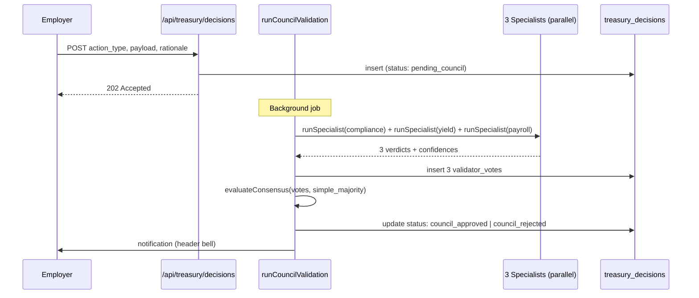

The treasury council is a three specialist Claude consensus that gates high stakes treasury operations: yield route changes, large allocation rebalances, and large payroll runs over a configured threshold. Each specialist has a distinct lens (compliance, capital efficiency, payroll continuity); a `simple_majority` over three votes determines whether the action proceeds.

This is a Phase 2 hardening on top of the standard owner-only access control. For employers running smaller teams or simpler treasury setups, the council is opt-in. For large enterprises with separation of duties policies, the council is the gate.

## Why three specialists

A single AI model judging "is this treasury action sensible" has two failure modes:

1. **Single point of opinion.** The model has biases. A specialist that always errs toward approval (or rejection) will systematically misclassify edge cases.
2. **Single attack surface.** A prompt injection that tricks the model into approving a malicious action breaks all approvals.

Three specialists with distinct system prompts and distinct lenses produce uncorrelated judgments. An attacker who finds a prompt injection that bypasses the compliance specialist still has to bypass the yield specialist and the payroll specialist before the action passes consensus. A specialist with a structural bias is outvoted by the others.

The three specialists:

| Specialist | Lens | What it checks |
|---|---|---|
| **Compliance** | Regulatory exposure | Sanctions list overlap, jurisdiction restrictions, KYC status of recipients, policy alignment |
| **Yield** | Capital efficiency | Risk-adjusted yield uplift, transaction cost vs marginal benefit, allow-list strategy validation |
| **Payroll continuity** | Employee payment timing | 30-day liquidity headroom, historical payment cadence, amount consistency vs prior runs |

Each runs as a separate Claude completion with a separate system prompt. They don't share state during evaluation. The system prompts live in `lib/agents/specialists.ts`.

## How a decision flows

Three specialists run in parallel via `Promise.all`. Each returns `{ verdict, confidence, reasoning }`. Their votes are persisted in `validator_votes` with `decision_type='treasury_action'`. Consensus is evaluated using the same primitive as escrow (`lib/validators/consensus.ts`).

If consensus approves, the decision row's `status` flips to `council_approved` and the `council_approved_at` timestamp is set. The execution path that triggered the proposal (e.g., the payroll executor for `large_payroll_approval`) reads this timestamp as a gate before broadcasting on-chain.

If consensus rejects, the decision is `council_rejected` with the per specialist reasoning preserved in the row. The dashboard shows the breakdown so the employer can understand which specialist flagged what.

## Action types supported (Ship 7 scope)

| Action | What it does | Council gates |
|---|---|---|
| `yield_route_change` | Updates the employer's yield model (`employer_keeps`, `employee_bonus`, `split`) | Yes |
| `allocation_rebalance` | Routes capital between approved yield strategies | Yes (currently a no-op stub; wire to YieldRouter is Phase 2) |
| `large_payroll_approval` | Flags a payroll run over the configured threshold as council-approved | Yes (the payroll executor reads `council_approved_at` before broadcasting) |

The `LARGE_PAYROLL_THRESHOLD` defaults to $50,000 per run. Below that, the payroll wizard fires immediately without council. Above, the wizard creates a `treasury_decisions` row, runs the council, and unlocks the run only on approval.

## Notification surface

When the council finishes, the employer's dashboard bell fires a `council_decision` notification. Severity flips to `success` on approval, `warning` on rejection. The body summarizes the vote: "2/3 specialists approved at 73% confidence." The notification metadata carries the decision_id so the dashboard can render the full per-specialist reasoning on click.

## Why not a multisig

A multisig (e.g., a Safe / Squads wallet) is the natural stronger gate, but it requires:

1. Multiple human signers responding within a tight window.
2. Out-of-band coordination (Slack, email) on context per signature.
3. Human availability that doesn't scale to high frequency operations.

For high frequency treasury actions (daily yield rebalances, hourly payroll plans), a council of LLM specialists with distinct lenses is more practical than asking three humans to sign every transaction. The audit trail is on-chain (vote rows persist), the reasoning is preserved, and the latency is seconds rather than hours.

For very high stakes actions (over $500K, mainnet contract upgrades, key rotations), a multisig still applies. The council and multisig are layers; the council handles the operational tier, the multisig handles the strategic tier. Multisig hardening is a Phase 2 milestone.

## When to enable

Recommended threshold: `LARGE_PAYROLL_THRESHOLD = $50K` for any company with an HR finance separation. Smaller companies may turn the council off entirely (set the threshold to `MAX_UINT256` and proposals stop firing). Companies with regulatory disclosure requirements should enable it always; the on-chain decision trail is auditable.
