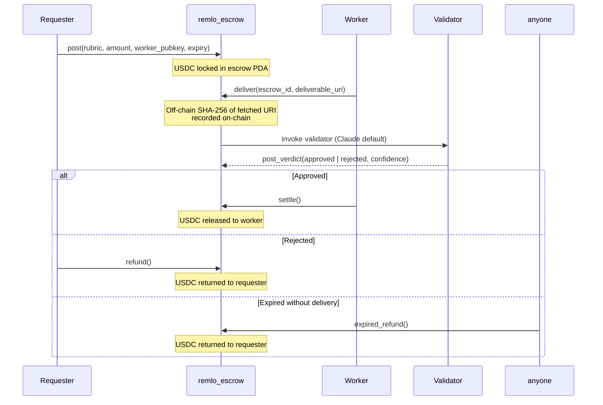

Remlo's escrow primitive lets a requester pay a worker conditional on a deliverable matching a rubric. Funds are custodied by an Anchor program on Solana. Settlement happens automatically once a validator (default: Claude. Configurable: human arbitrators or multi-validator consensus) posts a verdict.

Funds are never held by Remlo. The escrow PDA is the trust boundary. Even with full server compromise, funds remain claimable by the correct counterparty because the program rejects any settle that doesn't match the recorded verdict.

## The flow



Three parties, four lifecycle states (`posted` → `delivered` → `validating` → `settled` or `rejected_refunded` or `expired_refunded`).

## What's on-chain

- **Escrow PDA** holds the locked USDC. PDA derivation: `[b"escrow", requester_pubkey, escrow_id]`. The program enforces this derivation on every settle/refund call. Any caller passing a different derivation gets `ConstraintSeeds`.
- **Rubric hash** (32 bytes). The program records the SHA-256 of the rubric text. The off-chain rubric is what the validator reads; the on-chain hash makes the rubric tamper evident.
- **Worker wallet**, **requester wallet**, **mint** (USDC), **expiry timestamp**, **status**, **validator authority** (the Privy server wallet).
- **Validator verdict** (after `post_verdict`): `approved` | `rejected`, plus `confidence_bps` on a 0..10000 scale.
- **Settlement signature** or **refund signature** (after the matching crank).

## Why only `post_verdict` is privileged

The audit principle: minimize the surface where a privileged signer can move funds. Of the four state transitions:

| Action | Who can sign | Why |
|---|---|---|
| `post(...)` | Requester | They're funding the escrow. Their wallet pays. |
| `deliver(...)` | Worker (recorded at post time) | They're submitting the deliverable. The program checks `worker == escrow.worker`. |
| `post_verdict(...)` | Privy server wallet (policy gated) | The validator authority. Only signature in the flow that's privileged. |
| `settle()` / `refund()` / `expired_refund()` | Anyone | Permissionless cranks. Recipient is determined by the recorded verdict and PDA, not by `msg.sender`. |

The Privy server wallet's policy whitelist on Solana includes the `remlo_escrow` program but only the `post_verdict` instruction. The wallet cannot withdraw escrow funds. The wallet cannot post a new escrow with itself as recipient. The wallet cannot settle or refund. Any drift in this policy is detected at signing time via `assertPrivyPolicyAttached` and the signer fails closed.

A fully compromised Remlo server can, at most, post a verdict on an existing escrow. The verdict choice (`approved` or `rejected`) determines who the program will release funds to on the next crank. The compromised server cannot redirect those funds.

## Audit fix M-4 (deployed 2026-05-03)

Approved verdicts now require `confidence_bps > 0`:

```rust
if matches!(verdict, VerdictState::Approved) {
    require!(confidence_bps > 0, EscrowError::InvalidConfidence);
}
require!(confidence_bps <= 10_000, EscrowError::InvalidConfidence);
```

Before the fix, an `Approved` verdict with zero confidence was technically accepted. Validators that returned high confidence rejection but couldn't form an approval signal had to artificially fabricate a non-zero confidence to stay below the consensus threshold. The fix forces approval to carry a real signal.

## Multi validator consensus

When configured, an escrow accepts votes from multiple validators before resolving. Supported rules:

- **`simple_majority`**. (N/2 + 1) approvals settle, otherwise refund.
- **`unanimous`**. All N must approve. Any rejection refunds.
- **`weighted`**. Each validator has a weight; the sum of weights on the winning side must exceed a threshold.

Validators types supported today: `llm_claude` (production), `llm_gpt4` (extension point, not implemented), `oracle` (extension point, not implemented), `human` (manual arbitrator UI).

Votes accumulate in Supabase as they come in. `tryFinalizeConsensus` evaluates the rule on each new vote. When the rule resolves, exactly one atomic `post_verdict` is broadcast on-chain via the Privy server wallet. After that the program is back in the single validator path: anyone can crank settle or refund.

## Off-chain deliverable handling

Workers submit a URI rather than uploading the deliverable to Solana directly (storage on Solana is expensive). Remlo fetches the URI server side with a 10s timeout and 100KB max body, computes SHA-256, and records the hash on-chain via `record_deliverable`. The validator reads the deliverable text and the rubric from the off-chain copy; the on-chain hash is the integrity anchor.

If the worker submits a deliverable signed by an external key (e.g., they don't want to leak their writing to a dashboard widget), the `/deliver-signed` flow accepts a pre-signed transaction the program executes. The program re-derives the escrow PDA and checks that the inner instruction references it; multi-instruction transactions are rejected.

## Reputation writes

On settle: a `remlo-escrow-settled` SAS attestation is enqueued for the worker. Their reputation tier improves on the next read.

On refund (rejected or expired): a `remlo-escrow-refunded` attestation goes to the requester so they accumulate a "this person posted reasonable escrows that didn't pan out" track record. Workers get nothing for failed escrows.

In parallel, an ERC-8004 `giveFeedback` write goes to the validator agent on Tempo with `int128` value `+100` for approved, `-50` for rejected, and a structured tag set documenting the outcome. This builds the validator's reputation alongside the workers'.

## Live deployment

Solana devnet:

```
2CY3JQfkXpyTT8QBiHfKnashxGJ37ctDvqcgi7ggWiAA
```

[View on explorer](https://explorer.solana.com/address/2CY3JQfkXpyTT8QBiHfKnashxGJ37ctDvqcgi7ggWiAA?cluster=devnet).

Mainnet upgrade is gated on Anchor program audit completion and is a Phase 2 milestone.

## API surface

Three multi-rail endpoints:

- `POST /api/mpp/escrow/post` ($0.10). Create an escrow with auto Claude validation.
- `POST /api/mpp/escrow/deliver` ($0.02). Submit deliverable URI. (Or `/escrow/deliver-signed` for external-key workers.)
- `GET /api/mpp/escrow/{id}/status` ($0.01). Read lifecycle status, public sanitized fields only.

All three accept payment in USDC on Tempo, Base, or Solana via the multi-rail charge primitive.
